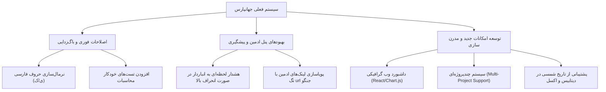

# 📊 گزارش تحلیل و موشکافی پروژه سیستم موازنه متریال جهانپارس

این سند شامل بررسی همه‌جانبه معماری، مدل داده‌ها، بخش‌های امنیتی، نقاط قوت و ضعف، ایرادات فنی کشف‌شده و در نهایت ایده‌های اصلاحی و توسعه‌ای برای ارتقای سیستم موازنه متریال شرکت جهانپارس است.

---

## 🔍 خلاصه معماری و جریان داده سیستم

پروژه بر پایه فریم‌ورک قدرتمند **Django 6.0** و **Django REST Framework (DRF)** پیاده‌سازی شده و از دیتابیس سبک و سریع **SQLite** در فاز توسعه بهره می‌برد. تمامی تعاملات کاربران نهایی در حال حاضر از طریق **پنل مدیریت پیشرفته جنگو (Django Admin)** که برای زبان فارسی و راست‌چین (RTL) بهینه شده، انجام می‌پذیرد.

### ۱. مدل‌های داده کلیدی ([models.py](file:///e:/Codes/Jahan%20pars/balance/models.py)):
- **User (کاربر):** مدل سفارشی ارث‌بری‌شده از `AbstractUser` که فیلد `role` را برای مدیریت نقش‌های «دفتر فنی» (`TECHNICAL`) و «انباردار» (`WAREHOUSE`) اضافه کرده است.
- **Contractor (پیمانکار):** ذخیره‌سازی مشخصات پیمانکاران که به صورت هوشمند و پویا ایجاد می‌شوند.
- **WorkCategory (رسته کاری):** دسته‌بندی‌های کلی فعالیت‌ها مانند پایپینگ، سیویل، برق و... که توسط دفتر فنی مدیریت می‌شود.
- **MaterialItem (کالا/متریال):** تعریف مشخصات کالاها شامل واحد اندازه‌گیری و درصد پرتی مجاز (`waste_percentage`).
- **WarehouseTransaction (تراکنش انبار):** ثبت ورود کالا به انبار کارگاه با شماره بارنامه (`IN`) یا خروج کالا و تحویل به پیمانکار با مشخصات قرارداد (`OUT`).
- **TechnicalOfficeApproval (تاییدیه عملکرد):** تایید مقادیر کار مفید انجام‌شده توسط پیمانکاران توسط دفتر فنی.

### ۲. فرمول طلایی موازنه متریال ([services.py](file:///e:/Codes/Jahan%20pars/balance/services.py)):
موازنه و انحراف مصرف متریال برای هر کالا به صورت زیر محاسبه می‌شود:
$$\text{Allowed Waste (پرتی مجاز)} = \text{Approved Quantity (کار تاییدشده)} \times \frac{\text{Waste Percentage (درصد پرتی)}}{100}$$
$$\text{Balance (موازنه)} = \text{Total Issued (کل تحویلی انبار)} - (\text{Approved Quantity} + \text{Allowed Waste})$$

- **موازنه مثبت (> 0):** نشان‌دهنده مازاد پرداخت متریال (مصرف‌نشده نزد پیمانکار).
- **موازنه منفی (< 0):** نشان‌دهنده کسری متریال (هدررفت بیش از حد مجاز توسط پیمانکار و بدهکاری به شرکت).
- **موازنه صفر (= 0):** تعادل ایده‌آل و بهینه.

---

## 🌟 نقاط قوت برجسته پروژه

در بررسی اولیه، چندین تصمیم طراحی بسیار عالی و باکیفیت در پروژه مشاهده شد:
1. **امنیت مبتنی بر نقش هوشمند (RBAC):** امنیت در دو لایه مدل با متد `has_perm` در [models.py](file:///e:/Codes/Jahan%20pars/balance/models.py) و لایه API با کلاس‌های دسترسی سفارشی در [permissions.py](file:///e:/Codes/Jahan%20pars/balance/permissions.py) پیاده‌سازی شده که دسترسی انباردار و دفتر فنی را به زیبایی و با دقت بالا مجزا می‌کند.
2. **رابط کاربری پیشرفته و اختصاصی ادمین:** استفاده از کدهای جاوااسکریپت سفارشی در [transaction_dynamic_form.js](file:///e:/Codes/Jahan%20pars/balance/static/balance/js/transaction_dynamic_form.js) برای نمایش/مخفی‌سازی پویای فیلدها متناسب با نوع تراکنش (ورود/خروج) تجربه کاربری بسیار خوبی خلق کرده است.
3. **قالب‌بندی فوق‌العاده گزارش اکسل:** منطق تولید گزارش اکسل در [services.py](file:///e:/Codes/Jahan%20pars/balance/services.py) با استفاده از `openpyxl` بسیار حرفه‌ای و شیک است. رعایت فونت، رنگ‌بندی‌های وضعیت (قرمز، سبز، زرد)، راست‌چین کامل شیت، گروه‌بندی خودکار بر اساس پیمانکار در تب‌های جداگانه، فریز کردن هدرها و اعمال AutoFilter فراتر از یک خروجی ساده است.
4. **ثبت اتوماتیک پیمانکار:** انباردار نیازی به تعریف جداگانه پیمانکار ندارد؛ سیستم در متد `save()` تراکنش خروجی، به صورت خودکار پیمانکار را ایجاد یا بازیابی می‌کند.

---

## ⚠️ ایرادات فنی و باگ‌های پنهان (Technical Debt & Defects)

در تحلیل موشکافانه کدهای پروژه، چند ایراد فنی و باگ احتمالی شناسایی شد که در شرایط عملیاتی واقعی می‌توانند مشکل‌ساز شوند:

### ۱. باگ عدم یکپارچگی نویسه‌های فارسی/عربی (بسیار بحرانی در وب فارسی)
> [!WARNING]
> در مدل [models.py](file:///e:/Codes/Jahan%20pars/balance/models.py) خط ۲۱۵، از متد `Contractor.objects.get_or_create` برای ثبت خودکار پیمانکاران استفاده شده است.
> از آنجا که این مقایسه بر اساس رشته متنی انجام می‌شود، تفاوت‌های رایج کیبوردها در تایپ حروف فارسی و عربی (مانند **«ی» فارسی U+06CC** با **«ي» عربی U+064A**، یا **«ک» فارسی U+06A9** با **«ك» عربی U+0643**) باعث ثبت رکوردهای تکراری می‌شود.
> 
> *سناریوی خطا:* اگر انباردار در یک تراکنش نام پیمانکار را «علی» (با ی فارسی) و در تراکنش دیگر «علي» (با ی عربی) وارد کند، سیستم دو پیمانکار مجزا در دیتابیس ثبت می‌کند! در نتیجه گزارش بالانس متریال این پیمانکار شکسته شده و در دو شیت مجزا با محاسبات کاملاً اشتباه توزیع خواهد شد.

### ۲. ریسک همروندی و عدم استفاده از Transaction در ساخت خودکار پیمانکار
در متد `save` مدل `WarehouseTransaction` عملیات `get_or_create` بدون استفاده از تراکنش‌های اتمیک پایگاه داده (`transaction.atomic`) یا قفل‌های امن انجام می‌شود. در صورت ارسال همزمان چندین تراکنش خروجی انبار برای یک پیمانکار جدید، احتمال بروز خطای عدم یکپارچگی دیتابیس (`IntegrityError`) وجود دارد.

### ۳. نبود سیستم هشدار لحظه‌ای (Preventive Warnings) در زمان تحویل متریال
سیستم در حال حاضر کاملاً پس‌نگر (Reactive) است. یعنی انباردار می‌تواند بدون هیچ محدودیتی ۱۰۰۰ متر لوله به پیمانکاری بدهد که عملکرد تاییدشده او فقط ۵۰ متر است! سیستم هیچ هشداری در پنل ادمین یا خروجی API در لحظه ثبت تراکنش نشان نمی‌دهد و انحراف فاحش متریال تازه در انتهای ماه و با دانلود فایل اکسل مشخص می‌شود.

### ۴. سخت‌کد شدن آدرس‌های API در قالب‌های ادمین
> [!NOTE]
> در فایل‌های [custom_index.html](file:///e:/Codes/Jahan%20pars/balance/templates/admin/custom_index.html#L27) و [approval_change_list.html](file:///e:/Codes/Jahan%20pars/balance/templates/admin/balance/approval_change_list.html#L6) آدرس دانلود گزارش به صورت سخت‌کد (Hardcoded) به شکل `/api/balance/download/` نوشته شده است. اگر در آینده پیشوند آدرس‌های پروژه تغییر کند (مثلاً به `/api/v1/` تغییر یابد)، این دکمه‌ها در پنل مدیریت خراب خواهند شد.

### ۵. فاقد تست‌های خودکار (Empty Test Suite)
فایل [tests.py](file:///e:/Codes/Jahan%20pars/balance/tests.py) کاملاً خالی است. فرمول‌های ریاضی و منطق توزیع کالاها در شیت‌های مختلف اکسل فاقد هرگونه تست واحد (Unit Test) یا تست یکپارچگی (Integration Test) هستند. هرگونه تغییر آینده در مدل‌ها ممکن است بدون متوجه شدن، محاسبات مالی و فیزیکی پروژه را خراب کند.

---

## 💡 ایده‌ها و پیشنهادات توسعه و اصلاح پروژه (Roadmap & Ideas)

برای ارتقای این سیستم به یک نرم‌افزار حرفه‌ای و در سطح سازمانی (Enterprise)، پیشنهادهای زیر ارائه می‌شود:



### بخش اول: اصلاحات فوری و ضروری (Quick Wins)

#### ۱. پیاده‌سازی کلاس نرمال‌سازی متون فارسی (Persian Normalizer)
پیشنهاد می‌شود یک ماژول کمکی ایجاد کرده و در متد `save()` مدل‌ها و سریالایزرها استفاده کنیم تا مطمئن شویم تمام حروف عربی و فاصله‌های اضافی قبل از ذخیره در پایگاه داده یکسان‌سازی می‌شوند.
```python
# نمونه تابع پیشنهادی برای افزودن به پروژه
def normalize_persian_text(text: str) -> str:
    if not text:
        return ""
    replacements = {
        "ي": "ی",
        "ك": "ک",
        "ة": "ه",
        "‌": " ", # نیم‌فاصله به فاصله معمولی یا برعکس بر اساس استاندارد پروژه
    }
    normalized = text.strip()
    for key, value in replacements.items():
        normalized = normalized.replace(key, value)
    return normalized
```

#### ۲. استفاده از تگ‌های داینامیک در قالب‌های ادمین
در قالب‌های HTML ادمین، به جای `/api/balance/download/` از آدرس‌دهی معکوس جنگو استفاده کنیم:
```html
<a href="">دانلود گزارش Excel</a>
```

#### ۳. توسعه تست‌های خودکار برای فرمول‌های موازنه
نوشتن تست‌های واحد برای سناریوهای مختلف محاسبه موازنه متریال (مقدار خروجی، مقدار تایید‌شده، پرتی مجاز، موازنه منفی و مثبت) تا از درستی کارکرد سیستم ریاضی آن مطمئن شویم.

---

### بخش دوم: بهبودهای پیشرفته و پنل مدیریت

#### ۴. سیستم هشدار و کنترل سقف مصرف (Over-consumption Alert)
می‌توان یک اعتبارسنجی در سریالایزر و فرم ادمین تراکنش خروجی انبار اضافه کرد. زمانی که انباردار می‌خواهد متریالی به پیمانکار تحویل دهد، سیستم وضعیت موازنه قبلی او را بررسی کرده و در صورتی که انحراف منفی او از حد مجاز (مثلاً ۱۰ درصد کار تاییدشده) بیشتر بود، سه کار انجام دهد:
- **حالت نرم:** نمایش یک هشدار زرد رنگ در فرم ادمین.
- **حالت سخت:** جلوگیری از ثبت تراکنش تا زمانی که دفتر فنی تاییدیه جدید صادر کند یا مجوز خاص صادر شود.

#### ۵. بومی‌سازی کامل تاریخ‌ها به شمسی (Jalali Date)
از آنجا که سیستم در ایران و پروژه جهانپارس استفاده می‌شود، استفاده از تاریخ‌های میلادی برای انباردار و دفتر فنی سخت است. پیشنهاد می‌شود با استفاده از پکیج‌های معتبری مثل `django-jalali` فیلدهای تاریخ در پنل ادمین و همچنین در ستون‌های گزارش اکسل به صورت شمسی نمایش داده شوند.

---

### بخش سوم: توسعه و مدرن‌سازی سیستم (Wow Factor)

#### ۶. طراحی و ساخت یک داشبورد وب گرافیکی و مدرن (Web Dashboard)
به جای اینکه مدیران ارشد پروژه برای هر بار دیدن وضعیت مجبور به دانلود و باز کردن فایل اکسل باشند، یک صفحه وب فوق‌العاده زیبا، واکنش‌گرا و پویا با استانداردهای مدرن طراحی کنیم که مستقیماً به API متصل شود.
- **ویژگی‌های داشبورد:**
  - نمودارهای دایره‌ای و ستونی مصرف متریال بر اساس رسته‌های کاری (پایپینگ، سیویل و...) با کتابخانه Chart.js یا Recharts.
  - لیست ۵ پیمانکار با بیشترین کسری متریال (قرمز) جهت پیگیری فوری.
  - کارت‌های شاخص کلیدی (KPIs) شامل: کل متریال وارد شده به انبار کارگاه، کل متریال تحویل شده، کل کار مفید تایید شده.
  - امکان اعمال فیلتر سریع بر اساس پیمانکار، کالا و بازه زمانی بدون رفرش صفحه.

- **تصویرسازی از طراحی پیشنهادی داشبورد:**
  پوسته تاریک متالیک همراه با المان‌های شیشه‌ای (Glassmorphism)، استفاده از فونت مدرن ایرانی (مانند وزیرمتن یا دانا)، کارت‌های رنگی وضعیت موازنه با سایه‌های نئونی ملایم که جلوه بصری فوق‌العاده حرفه‌ای به پروژه می‌دهد.

#### ۷. پشتیبانی از چندپروژه‌ای (Multi-Project Support)
در حال حاضر دیتابیس فرض را بر وجود یک پروژه کارگاهی تک‌محور گذاشته است. با افزودن مدل `Project` می‌توان سیستم را به صورتی توسعه داد که شرکت جهانپارس بتواند چندین پروژه ملی یا منطقه‌ای خود را به صورت همزمان در این سیستم مدیریت کند و کاربران هر کارگاه فقط به داده‌های کارگاه خود دسترسی داشته باشند.

---

## 📢 تصمیم‌گیری و قدم‌های بعدی

نظرات و بازخورد شما درباره این گزارش بسیار ارزشمند است. برای شروع کار، می‌توانیم مراحل زیر را به ترتیب پیش ببریم:

1. **فاز اول (تثبیت و رفع ایرادات):** اعمال بهینه‌سازی نرمال‌سازی متون فارسی در مدل‌ها و داینامیک کردن آدرس‌ها در ادمین.
2. **فاز دوم (تست‌نویسی):** پیاده‌سازی تست‌های کامل برای تضمین صحت محاسبات موازنه در خدمات گزارش‌گیری.
3. **فاز سوم (پیشگیری):** اضافه کردن کنترل مصرف در فرم‌های خروج انبار.
4. **فاز چهارم (مدرن‌سازی):** طراحی و توسعه داشبورد زیبای فرانت‌اند.

> [!TIP]
> لطفاً نظرات خود را در مورد پیشنهادات بالا مطرح کنید تا بر اساس اولویت‌های مد نظر شما، برنامه اجرایی فاز بعدی را تدوین کنیم.
